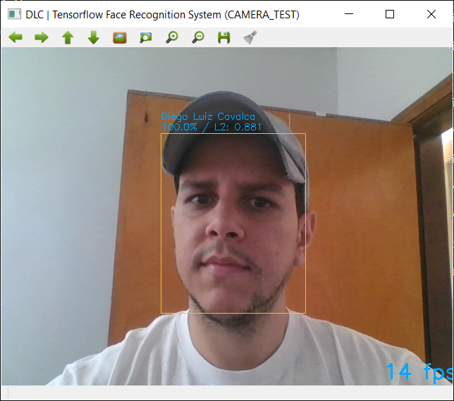

# Tensorflow Face Recognition System

This is a tiny face recognition system, implemented using Tensorflow, based on the Deep Learning Facenet model (https://github.com/davidsandberg/facenet).

## Getting Started

These instructions will get you a copy of the project up and running on your local machine for development and testing purposes.

### Prerequisites

All testing was performed on Windows 10. 

In addition, the entire development and testing environment were created based on the tools available in the [Anaconda](https://www.anaconda.com/). 

Therefore, [install it](https://www.anaconda.com/) on your machine. 

### Installing

Considering the prerequisites described above, and downloaded this project on your machine, you should download the [LFW Pre-trained model](https://drive.google.com/file/d/1EXPBSXwTaqrSC0OhUdXNmKSh9qJUQ55-/view) and extract it in the following path:

```
/PATH_TO_FACE_RECOGNITION/library/facenet/models/
```

Finally, you must create the Python environment for running the system. To facilitate this step, I created a batch file that creates the environment and installs the necessary libraries for system execution (Numpy, tensorflow, etc.). Then simply run it (and confirm the requests that appear in the terminal) by double-clicking in the file:

```
/PATH_TO_FACE_RECOGNITION/resources/install-env_windows.cmd
```

If you has a GPU available on your machine, run the alternative batch file:

```
/resources/install-env_windows_gpu.cmd
```

This is it!

## Running the system

Explain how to run the automated tests for this system

```
cd /PATH_PROJECTO_LOCAL_MACHINE/
activate facerecognition
python system.py
```

and voila! 



## Observations

As you can see in /datasets/demo/, this system only recognizes 2 people (me and my girlfriend!) By default, but it is possible to insert and retrain the system to recognize new people ('ve already tested with more than 3000 different persons). By the way, I provide here the necessary resources to do this, which are the files:

```
- /register.py
- /train_classifier.py
```
Unfortunately, I dn't have much time currently to describe in detail how to do this.

But the resources are there!! Enjoy this opportunity, try to discover how to register new people (including you and your friends!) and retrain the system classifier, this can be a great challenge for you!

More questions?! Send me a message at contato@diegocavalca.com so we can talk (I'll reply as soon as possible, I promise).